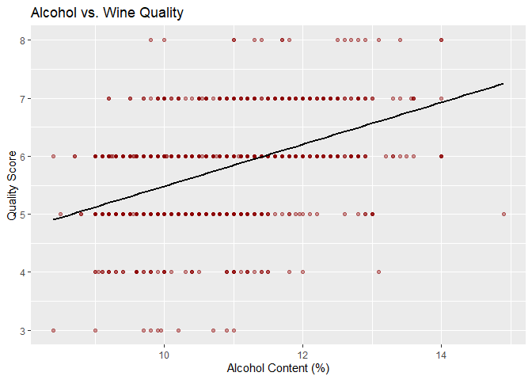
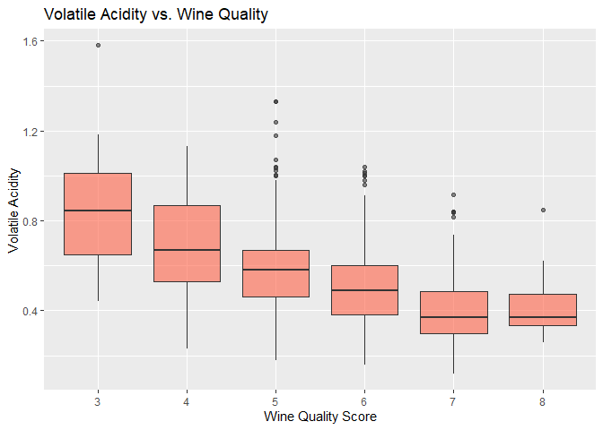
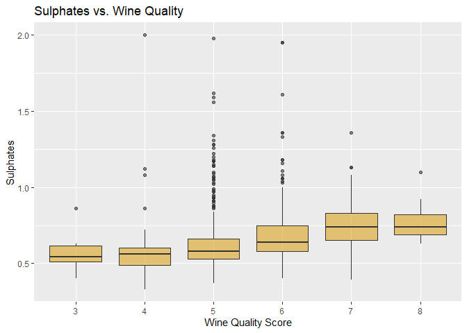

README
================

## 1. Business Understanding

In this project, the objective is to identify the chemical characteristics that influence wine quality. A wine producer has asked for help in understanding what factors contribute to a good quality wine, using data from the UCI Wine Quality Dataset. Wine quality is typically assessed by trained sensory analysts and can depend on several chemical features such as acidity, alcohol content, sugar levels, and sulfur dioxide levels.

Based on background research and intuition, I hypothesize that features like higher alcohol content and balanced acidity levels may correlate positively with better wine quality. On the other hand, extremely high levels of certain components like sulfur dioxide may negatively affect taste and thus reduce quality. Through exploratory data analysis and statistical testing, I aim to extract non-obvious insights about what makes a wine “good” or “bad” according to the dataset.

## 2. Data Understanding

In this section, we load the red wine dataset and explore its structure.

``` r
# Load required library
library(tidyverse)
```

    ## ── Attaching core tidyverse packages ──────────────────────── tidyverse 2.0.0 ──
    ## ✔ dplyr     1.1.4     ✔ readr     2.1.5
    ## ✔ forcats   1.0.0     ✔ stringr   1.5.1
    ## ✔ ggplot2   3.5.2     ✔ tibble    3.2.1
    ## ✔ lubridate 1.9.4     ✔ tidyr     1.3.1
    ## ✔ purrr     1.0.4     
    ## ── Conflicts ────────────────────────────────────────── tidyverse_conflicts() ──
    ## ✖ dplyr::filter() masks stats::filter()
    ## ✖ dplyr::lag()    masks stats::lag()
    ## ℹ Use the conflicted package (<http://conflicted.r-lib.org/>) to force all conflicts to become errors

``` r
# Load the dataset (must be in same folder as your .Rmd file)
red_wine <- read.csv2("winequality-red.csv")

# View structure of dataset
str(red_wine)
```

    ## 'data.frame':    1599 obs. of  12 variables:
    ##  $ fixed.acidity       : chr  "7.4" "7.8" "7.8" "11.2" ...
    ##  $ volatile.acidity    : chr  "0.7" "0.88" "0.76" "0.28" ...
    ##  $ citric.acid         : chr  "0" "0" "0.04" "0.56" ...
    ##  $ residual.sugar      : chr  "1.9" "2.6" "2.3" "1.9" ...
    ##  $ chlorides           : chr  "0.076" "0.098" "0.092" "0.075" ...
    ##  $ free.sulfur.dioxide : chr  "11" "25" "15" "17" ...
    ##  $ total.sulfur.dioxide: chr  "34" "67" "54" "60" ...
    ##  $ density             : chr  "0.9978" "0.9968" "0.997" "0.998" ...
    ##  $ pH                  : chr  "3.51" "3.2" "3.26" "3.16" ...
    ##  $ sulphates           : chr  "0.56" "0.68" "0.65" "0.58" ...
    ##  $ alcohol             : chr  "9.4" "9.8" "9.8" "9.8" ...
    ##  $ quality             : int  5 5 5 6 5 5 5 7 7 5 ...

``` r
# View summary statistics
summary(red_wine)
```

    ##  fixed.acidity      volatile.acidity   citric.acid        residual.sugar    
    ##  Length:1599        Length:1599        Length:1599        Length:1599       
    ##  Class :character   Class :character   Class :character   Class :character  
    ##  Mode  :character   Mode  :character   Mode  :character   Mode  :character  
    ##                                                                             
    ##                                                                             
    ##                                                                             
    ##   chlorides         free.sulfur.dioxide total.sulfur.dioxide   density         
    ##  Length:1599        Length:1599         Length:1599          Length:1599       
    ##  Class :character   Class :character    Class :character     Class :character  
    ##  Mode  :character   Mode  :character    Mode  :character     Mode  :character  
    ##                                                                                
    ##                                                                                
    ##                                                                                
    ##       pH             sulphates           alcohol             quality     
    ##  Length:1599        Length:1599        Length:1599        Min.   :3.000  
    ##  Class :character   Class :character   Class :character   1st Qu.:5.000  
    ##  Mode  :character   Mode  :character   Mode  :character   Median :6.000  
    ##                                                           Mean   :5.636  
    ##                                                           3rd Qu.:6.000  
    ##                                                           Max.   :8.000

## 3. Data Preparation

The dataset was initially read in with all variables as character types, due to the semicolon delimiter. We now convert all columns except for the target variable `quality` to numeric format and check for missing values introduced during the conversion.

``` r
# Convert all columns to numeric
red_wine <- red_wine %>%
  mutate(across(everything(), as.numeric))

# Check the updated structure
str(red_wine)
```

    ## 'data.frame':    1599 obs. of  12 variables:
    ##  $ fixed.acidity       : num  7.4 7.8 7.8 11.2 7.4 7.4 7.9 7.3 7.8 7.5 ...
    ##  $ volatile.acidity    : num  0.7 0.88 0.76 0.28 0.7 0.66 0.6 0.65 0.58 0.5 ...
    ##  $ citric.acid         : num  0 0 0.04 0.56 0 0 0.06 0 0.02 0.36 ...
    ##  $ residual.sugar      : num  1.9 2.6 2.3 1.9 1.9 1.8 1.6 1.2 2 6.1 ...
    ##  $ chlorides           : num  0.076 0.098 0.092 0.075 0.076 0.075 0.069 0.065 0.073 0.071 ...
    ##  $ free.sulfur.dioxide : num  11 25 15 17 11 13 15 15 9 17 ...
    ##  $ total.sulfur.dioxide: num  34 67 54 60 34 40 59 21 18 102 ...
    ##  $ density             : num  0.998 0.997 0.997 0.998 0.998 ...
    ##  $ pH                  : num  3.51 3.2 3.26 3.16 3.51 3.51 3.3 3.39 3.36 3.35 ...
    ##  $ sulphates           : num  0.56 0.68 0.65 0.58 0.56 0.56 0.46 0.47 0.57 0.8 ...
    ##  $ alcohol             : num  9.4 9.8 9.8 9.8 9.4 9.4 9.4 10 9.5 10.5 ...
    ##  $ quality             : num  5 5 5 6 5 5 5 7 7 5 ...

``` r
# Check for any missing values
colSums(is.na(red_wine))
```

    ##        fixed.acidity     volatile.acidity          citric.acid 
    ##                    0                    0                    0 
    ##       residual.sugar            chlorides  free.sulfur.dioxide 
    ##                    0                    0                    0 
    ## total.sulfur.dioxide              density                   pH 
    ##                    0                    0                    0 
    ##            sulphates              alcohol              quality 
    ##                    0                    0                    0

After converting the columns to numeric, all features are now correctly typed and ready for analysis. The dataset includes 1,599 observations and 12 variables. Importantly, no missing values were introduced during the conversion process, which indicates the data is clean and consistent. This allows us to move forward confidently with exploratory data analysis.

## 4. Modeling + Evaluating (EDA)

``` r
# Load ggplot2 (already included in tidyverse)
library(ggplot2)

# Scatter plot: Alcohol vs. Quality
ggplot(red_wine, aes(x = alcohol, y = quality)) +
  geom_point(alpha = 0.4, color = "darkred") +
  geom_smooth(method = "lm", se = FALSE, color = "black") +
  labs(title = "Alcohol vs. Wine Quality",
       x = "Alcohol Content (%)",
       y = "Quality Score")

### 1. Alcohol vs Wine Quality
 

```

<!-- -->

``` r
# Correlation test between alcohol and quality
cor.test(red_wine$alcohol, red_wine$quality)
```

    ## 
    ##  Pearson's product-moment correlation
    ## 
    ## data:  red_wine$alcohol and red_wine$quality
    ## t = 21.639, df = 1597, p-value < 2.2e-16
    ## alternative hypothesis: true correlation is not equal to 0
    ## 95 percent confidence interval:
    ##  0.4373540 0.5132081
    ## sample estimates:
    ##       cor 
    ## 0.4761663


### 1. Alcohol vs Wine Quality


Higher alcohol content is clearly associated with higher quality scores. The trend is upward, and the correlation coefficient (0.48) confirms a moderate-to-strong positive relationship.

This analysis explores whether alcohol content is associated with higher wine quality. The scatter plot shows a positive trend, and the linear regression line reinforces that higher alcohol levels may be linked to better quality ratings.

The correlation test quantifies this relationship. If the p-value is very small (typically \< 0.05), the correlation is statistically significant.

``` r
# Boxplot of Volatile Acidity by Quality
ggplot(red_wine, aes(x = as.factor(quality), y = volatile.acidity)) +
  geom_boxplot(fill = "tomato", alpha = 0.6) +
  labs(title = "Volatile Acidity vs. Wine Quality",
       x = "Wine Quality Score",
       y = "Volatile Acidity")
```

<!-- -->

``` r
# Correlation test between volatile acidity and quality
cor.test(red_wine$volatile.acidity, red_wine$quality)
```

    ## 
    ##  Pearson's product-moment correlation
    ## 
    ## data:  red_wine$volatile.acidity and red_wine$quality
    ## t = -16.954, df = 1597, p-value < 2.2e-16
    ## alternative hypothesis: true correlation is not equal to 0
    ## 95 percent confidence interval:
    ##  -0.4313210 -0.3482032
    ## sample estimates:
    ##        cor 
    ## -0.3905578



This boxplot shows that higher quality wines consistently have lower volatile acidity. The correlation coefficient of -0.39 confirms a statistically significant negative relationship.

This hypothesis tests whether lower volatile acidity is associated with higher wine quality. The boxplot shows the distribution of volatile acidity for each quality score. Visually, we expect to see lower acidity in higher-rated wines.

The correlation test further quantifies this relationship. A negative correlation coefficient and a small p-value would support the hypothesis that increased volatile acidity negatively affects wine quality.

The results support the hypothesis that volatile acidity negatively affects wine quality. The correlation coefficient of -0.39 indicates a moderate negative relationship, and the p-value (\< 2.2e-16) confirms that the result is statistically significant. The boxplot also shows a clear trend: higher quality wines consistently have lower levels of volatile acidity.

``` r
# Boxplot: Sulphates by Quality
ggplot(red_wine, aes(x = as.factor(quality), y = sulphates)) +
  geom_boxplot(fill = "goldenrod", alpha = 0.6) +
  labs(title = "Sulphates vs. Wine Quality",
       x = "Wine Quality Score",
       y = "Sulphates")
```

<!-- -->

``` r
# Correlation test between sulphates and quality
cor.test(red_wine$sulphates, red_wine$quality)
```

    ## 
    ##  Pearson's product-moment correlation
    ## 
    ## data:  red_wine$sulphates and red_wine$quality
    ## t = 10.38, df = 1597, p-value < 2.2e-16
    ## alternative hypothesis: true correlation is not equal to 0
    ## 95 percent confidence interval:
    ##  0.2049011 0.2967610
    ## sample estimates:
    ##       cor 
    ## 0.2513971

### 3. Sulphates vs Wine Quality


Sulphates have a mild positive correlation (0.25) with wine quality. Higher sulphates may help preserve wine and slightly improve taste, which is reflected in the quality scores.

Sulphates are compounds that help preserve wine and can impact aroma. This hypothesis tests whether higher sulphate levels correlate with better wine quality. The boxplot should reveal whether higher-rated wines have more sulphates.

The correlation test will provide statistical evidence. A positive correlation coefficient with a significant p-value would support this hypothesis.

The analysis supports the hypothesis that higher sulphate levels are associated with better wine quality. The correlation coefficient of 0.25, while modest, is statistically significant (p \< 2.2e-16). The boxplot visually confirms that higher quality wines tend to contain more sulphates, suggesting a potential positive impact of sulphates on wine quality.

## 5. Conclusion / Insights

Based on the exploratory data analysis of the red wine data set, the following insights were identified:

- **Higher alcohol content** is strongly associated with higher wine quality (r = 0.48, p \< 2.2e-16)
- **Higher volatile acidity** is associated with lower wine quality (r = -0.39, p \< 2.2e-16)
- **Higher sulphate levels** are modestly associated with higher quality (r = 0.25, p \< 2.2e-16)

These insights may help wine producers prioritize chemical features that influence taste and quality scores. While correlation does not imply causation, the findings offer a data-driven foundation for improving wine quality.

## 5. Final Summary and Insights For Non-Technical Readers

This project explores what makes red wine “good” or “bad” based on its chemical composition, using data from the UCI Wine Quality dataset. A wine producer hired us to analyze the data and provide insights into what chemical properties influence wine quality, so they can improve their production process.

### The Goal

Our goal was to identify **non-obvious patterns** in the data — things that might not be immediately visible, but that influence how a wine is rated in terms of quality. We used a method called **Exploratory Data Analysis (EDA)** to ask questions of the data, visualize it, and use statistics to back up our conclusions.

### The Dataset

We used the **Red Wine Quality Dataset** from UCI Machine Learning Repository, which contains **1,599 samples** of Portuguese red wine. Each wine sample has **12 variables**: - 11 are chemical properties (e.g., acidity, sugar, sulphates, alcohol) - 1 is the **quality score**, which is an integer from 0 to 10 (how good the wine is, based on human tasters)

When we first loaded the data, all columns were in the wrong format — they were being treated as text. We cleaned the data by converting everything to numbers, and confirmed there were **no missing values** — so the data was ready for analysis.

### The Process

We formed hypotheses about what might make wine taste better, then used: - **Visualizations** (like scatter plots and box plots) - **Statistical tests** (like correlation analysis)

This let us see how each chemical property relates to wine quality.

------------------------------------------------------------------------

### Hypothesis 1: **Higher Alcohol = Better Quality**

We predicted that wines with more alcohol would generally score higher.

- The scatter plot showed a clear **positive relationship**
- The correlation coefficient was **0.48**, meaning a moderate to strong link
- The p-value was extremely small (**\< 2.2e-16**), meaning this relationship is **statistically significant**

**Conclusion:** More alcohol tends to be associated with better wine quality.

------------------------------------------------------------------------

### Hypothesis 2: **Higher Volatile Acidity = Lower Quality**

Volatile acidity is what gives wine a vinegar-like sourness — and we guessed that higher levels would hurt quality.

- The boxplot showed that **higher-rated wines had much lower volatile acidity**
- The correlation was **-0.39** — a **moderate negative** relationship
- Again, the p-value was **\< 2.2e-16**, so this result is statistically strong

**Conclusion:** Wines with less volatile acidity tend to taste better.

------------------------------------------------------------------------

### Hypothesis 3: **Higher Sulphates = Better Quality**

Sulphates help preserve wine and can affect its aroma. We predicted that higher sulphates would improve quality — but expected the effect to be smaller.

- The boxplot showed a trend: **higher-rated wines had slightly more sulphates**
- The correlation was **0.25** — a **weak to moderate** positive relationship
- Still statistically significant with p-value **\< 2.2e-16**

**Conclusion:** Higher sulphates may help improve wine quality, but not as strongly as alcohol.

------------------------------------------------------------------------

### Key Takeaways

1.  **Alcohol** is the strongest predictor of wine quality among the features we tested.
2.  **Volatile acidity** has a clear **negative effect** on quality.
3.  **Sulphates** also play a role, but a smaller one.
4.  These relationships are **statistically significant**, meaning they are very unlikely to be due to chance.

------------------------------------------------------------------------

### Why This Matters

For a wine producer, these insights provide **actionable direction**: - Consider optimizing **alcohol content** to improve ratings. - Monitor and reduce **volatile acidity** to avoid spoilage or sourness. - Maintain healthy sulphate levels to preserve and improve taste — but don’t overdo it.

This project shows how data science and statistical thinking can translate into real-world decisions — even in something as subjective as wine tasting.

## 📊 Visualizations & Key Insights

### 1. Alcohol vs Wine Quality


Higher alcohol content is clearly associated with higher quality scores. The trend is upward, and the correlation coefficient (0.48) confirms a moderate-to-strong positive relationship.

---

### 2. Volatile Acidity vs Wine Quality


This boxplot shows that higher quality wines consistently have lower volatile acidity. The correlation coefficient of -0.39 confirms a statistically significant negative relationship.

---

### 3. Sulphates vs Wine Quality


Sulphates have a mild positive correlation (0.25) with wine quality. Higher sulphates may help preserve wine and slightly improve taste, which is reflected in the quality scores.

